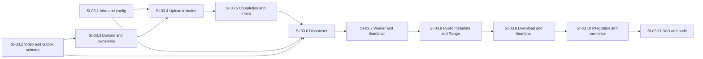

# phase-03-videos — Implementation Plan

## Objective and execution rules

Implement the BIAWS `desafio-04` canonical HTML's Fase 03 in the existing fork and `feature/phase-03-videos` branch. Inputs: [context](context.md), [validated decisions](../../decisions/technical-decisions-phase-03-videos.md), [library refs](library-refs.md), [clean validation](validation.md), Fase 02 code/conventions and `nestjs-project/AGENTS.md`. F03-06 confirms an upload and persists processing intent; **F03-07 alone publishes to BullMQ**. No video UI. Do not advance an SI with failing relevant tests; record commands/results in `progress.md`. The inherited migration-test/lint failures from F03-01 must be resolved before the F03-10 DoD, with origin preserved.

Commands below run from `nestjs-project/`. In the shell running them, define `compose() { docker compose -f compose.yaml -f compose.codex.yaml "$@"; }`; the `compose ...` commands below then execute literally. `npm`, `npx`, Node, TS and Jest run only via `compose exec -T nestjs-api`; integration suites run serially on the shared test DB. `compose.codex.yaml` is a local port override; container connections use service names.

## Fixed constants, configuration and topology

| Contract | Value / behavior |
| --- | --- |
| Upload ceiling | `10_000_000_000` bytes (decimal 10 GB), minimum 1 byte; reject non-integer declared size. |
| Multipart | 16 MiB (`16_777_216`) per nonfinal part; part count `ceil(expectedBytes / 16_777_216)`, maximum 597; exact final remainder. Sign at most 20 part numbers per API call. |
| Lifetime | Upload expires 24 h after initiation; presigned `UploadPart` URL expires in 900 s. Renew URLs without changing upload ID/key. |
| Media input | Allow `.mp4`/`video/mp4`, `.webm`/`video/webm`, `.mov`/`video/quicktime`, `.mkv`/`video/x-matroska`; title length 1..200, basename-only filename length 1..255. Declared MIME/extension are checked at initiation; ffprobe must find a decodable video stream before `ready`. |
| Storage | Private configurable `videos-originals` and `videos-thumbnails`; `channels/{channelId}/videos/{videoId}/original/source` and `channels/{channelId}/videos/{videoId}/thumbnails/{generation}.jpg`. No title/filename in keys. |
| Endpoints | API/worker S3 internal endpoint `http://minio:9000`; browser/host presign endpoint `http://localhost:9000` in local Compose. Do not rewrite a signed URL. S3 region `us-east-1`, path-style enabled for MinIO. |
| Queue | `video-processing`, `process-video-v1`, stable BullMQ ID `video-{uuid}-g{generation}`, `attempts:3`, exponential backoff from 30 s, `maxStalledCount:1`, worker concurrency 1. Retain completed for 7 days/1000 jobs and failed for 14 days/1000 jobs; DB is source of truth. |
| Reconciliation | Dispatcher scans every 30 s with 60 s row lease; if published job absent and video unfinished for >2 min, reset intent to pending and republish. Inspect failed jobs to set terminal `error`; never restart `ready` or older generation. |
| Worker resources | One job per container; minimum 12 GiB free temp disk, max 2 h/job, ffprobe 60 s, FFmpeg 120 s, lease renewal every 30 s. Abort subprocess/stream and remove temp files on any exit. Memory stays bounded by streams, not 10 GB. |

Add namespaced `storageConfig`, `queueConfig`, `videoConfig` and Joi validation for `S3_INTERNAL_ENDPOINT`, `S3_PUBLIC_ENDPOINT`, `S3_REGION`, `S3_CORS_ALLOWED_ORIGIN`, `S3_API_ACCESS_KEY`, `S3_API_SECRET_KEY`, `S3_WORKER_ACCESS_KEY`, `S3_WORKER_SECRET_KEY`, `S3_ORIGINALS_BUCKET`, `S3_THUMBNAILS_BUCKET`, `REDIS_HOST`, `REDIS_PORT`, `VIDEO_MAX_BYTES`, `VIDEO_PART_BYTES`, `VIDEO_UPLOAD_TTL_SECONDS`, `VIDEO_PRESIGN_TTL_SECONDS`, `VIDEO_WORKER_CONCURRENCY`, `VIDEO_TEMP_DIR`, `VIDEO_TEMP_MIN_FREE_BYTES`, `VIDEO_JOB_TIMEOUT_MS`, `VIDEO_FFPROBE_TIMEOUT_MS`, `VIDEO_FFMPEG_TIMEOUT_MS`, `VIDEO_DISPATCH_INTERVAL_MS`. Joi caps `VIDEO_MAX_BYTES` at `10_000_000_000` and fixes `VIDEO_PART_BYTES` to `16_777_216` for this contract. Example values go in `.env.example`; real credentials stay ignored. Bucket initializer alone holds MinIO admin credentials; API service account handles multipart on originals plus `GetObject` for ready proxy delivery, worker service account reads originals and writes thumbnails. API and worker share validated config factories but select different credentials and bootstrap different Nest application contexts: API has HTTP controllers and producer; worker has dispatcher and BullMQ consumer, without HTTP controller/server.

MinIO Community source is pinned to `RELEASE.2025-10-15T17-29-55Z` and built locally from the upstream tag because the upstream repository no longer publishes the patched image. Use Redis `7.4.7-alpine` with a named volume and `appendonly yes`, `appendfsync everysec`. Worker adds the FFmpeg/ffprobe Debian package candidate recorded in `library-refs.md`; verify binaries before a job. Compose provides API, PostgreSQL, Mailpit, MinIO, bucket initializer, Redis and worker. Buckets remain private; initializer creates separate limited API/worker policies idempotently. This MinIO Community build rejects bucket CORS, so Compose uses global `MINIO_API_CORS_ALLOW_ORIGIN` for the configured client origin. The smoke must prove signed `PUT`, preflight behavior and a browser-readable `ETag`; if global CORS does not expose it, add a narrow proxy before closing F03-04. Healthchecks, persistent storage and idempotent bucket initialization are required.

## Technical Specifications

For local MinIO Community, abandoned multipart parts are cleaned by the server's `MINIO_API_STALE_UPLOADS_EXPIRY=48h` and hourly cleanup. The 24-hour application upload TTL and explicit abort/cancel remain the primary controls. Production S3 requires an equivalent bucket lifecycle rule in deployment configuration.

### Data Model

**`videos`** (new TypeORM entity + versioned migration):

| Column | Type / constraint | Purpose |
| --- | --- | --- |
| `id` | UUID PK, generated | Internal identity; never the public URL. |
| `channel_id` | UUID FK → `channels.id`, NOT NULL, indexed; restrict delete while video exists | Ownership; channel resolved by authenticated `JwtPayload.sub` → `channels.user_id`. |
| `public_id` | varchar(22), NOT NULL, UNIQUE | `base64url(randomBytes(16))`; generate and retry unique violation in a fresh savepoint/transaction. |
| `title` | varchar(200), NOT NULL | Initiation metadata. |
| `status` | varchar(16), NOT NULL, CHECK `draft|processing|ready|error`, default `draft` | Processing state, separate from future visibility. |
| `generation` | integer NOT NULL CHECK >=1, default 1 | Reprocess epoch; stale jobs cannot update newer generation. |
| `declared_mime`, `safe_filename` | varchar(100), varchar(255), NOT NULL | MIME/filename validated and sanitized at initiation. |
| `expected_bytes` | bigint NOT NULL CHECK 1..10_000_000_000 | Exact client-declared size. Map to JS number only after safe-range check. |
| `uploaded_bytes` | bigint NULL | Confirmed HeadObject size. |
| `original_bucket`, `original_key` | varchar(100), text NOT NULL; unique(bucket,key) | Private original location. |
| `thumbnail_bucket`, `thumbnail_key`, `thumbnail_bytes` | varchar(100), text, bigint NULL | Ready thumbnail only. |
| `upload_id` | text NULL, unique when not null | S3 multipart ID kept server-side; not returned to client. |
| `upload_expires_at`, `upload_confirmed_at` | timestamptz NULL | Separate incomplete vs confirmed `draft`. |
| `completion_token`, `completion_lease_until` | UUID/timestamptz NULL | One API completion owner; lease renewed during S3 completion, recoverable after crash. |
| `object_etag` | text NULL | Strong S3 response validator for `If-Range`; never treated as full-file checksum. |
| `duration_ms` | bigint NULL CHECK >0 when present | From ffprobe. |
| `media_metadata` | jsonb NULL | Whitelisted format, width, height, codec and stream count; no raw paths/tags. |
| `failure_stage`, `failure_code` | varchar(32), varchar(64) NULL | Sanitized owner-visible outcome; detailed cause only in correlated logs. |
| `processing_token`, `processing_lease_until` | UUID/timestamptz NULL | Conditional worker ownership and crash recovery. |
| `created_at`, `updated_at` | timestamptz NOT NULL | Existing entity conventions. |

Indexes: unique `public_id`, unique `(original_bucket, original_key)`, partial unique `upload_id`, `(channel_id, created_at)`, `(status, upload_confirmed_at)`, `(status, processing_lease_until)`. Migration creates constraints explicitly and has a tested down path. No binary media in PostgreSQL.

**`video_processing_outbox`** (new entity + same migration): `id` UUID PK; `video_id` UUID FK → videos; `generation` integer; `event_name` constant `process-video-v1`; `schema_version` integer `1`; `status` `pending|published` with CHECK; `dispatch_attempts` integer; `lease_token` UUID NULL; `lease_until`, `last_attempt_at`, `published_at`, `created_at`, `updated_at` timestamptz. Unique `(video_id,generation)` and index `(status,lease_until,created_at)`. F03-06 inserts exactly one row in the confirmation transaction. F03-07 is sole writer of publication fields. No sensitive URLs, credentials or raw filenames in message/outbox payload.

### State machine and ownership

| From | To | Actor and guard |
| --- | --- | --- |
| new | `draft` | Authenticated owner initiates upload; channel FK and public ID created. |
| `draft` incomplete | `draft` confirmed | F03-06 validates storage and atomically sets `upload_confirmed_at` + inserts outbox. Repeated confirmation is read-only/idempotent. |
| `draft` incomplete | `error` | F03-06 abort/cancel/expiry/invalid size; record `failure_stage=upload`. New upload requires new video. |
| `draft` confirmed | `processing` | F03-07 worker claims current generation and token, with valid outbox/job. |
| `processing` | `ready` | Current token/generation; metadata and thumbnail exist and are persisted atomically. |
| `processing` | `error` | Invalid media or attempts exhausted, current token/generation. |
| `error` with confirmed original | `processing` | Authenticated explicit reprocess creates generation+1/outbox; worker then claims. Until claim, status stays `error`. |

All other transitions are rejected. `ready` is terminal in Fase 03. Claim/update uses conditional SQL on `id`, `generation`, `status`, and token; expired leases can be reclaimed. After temporary failure, clear/expire worker lease but keep `processing` for BullMQ retry. A stale worker cannot write metadata or move `ready` after newer generation. Owner-only routes return 404 for another owner's ID to avoid record enumeration. Public routes return 404 for unknown or non-ready ID, regardless of authenticated user. Ready videos are anonymously readable **by link** in this phase; no listing or Fase 04 visibility toggle is added.

### API Contracts

All API requests/responses are JSON except the media byte routes. Existing `ValidationPipe`, domain exception filter, JWT guard and Swagger patterns apply. `videoId` is UUID; `publicId` matches `[A-Za-z0-9_-]{22}`. All owner routes require Bearer JWT, resolve channel by `sub`, and verify video.channel_id. No route accepts bucket/key/upload ID from the client. Only `@Public()` read routes below bypass JWT.

| Method and path | Input | Success output | Notes |
| --- | --- | --- | --- |
| `POST /videos/uploads` | `{title:string, filename:string, mimeType:string, sizeBytes:number}` | `201 {videoId,publicId,status:"draft",partSize:16777216,partCount,expiresAt}` | Creates video before `CreateMultipartUpload`; if S3 init fails, compensate row/error safely; generated key is server-side. |
| `POST /videos/:videoId/upload-parts` | `{partNumbers:number[]}` 1..20 distinct, ascending, each `1..partCount` | `200 {parts:[{partNumber,url,expiresAt}]}` | URLs signed for public endpoint and current upload; no bytes through API. Reject expired/confirmed/cancelled upload. |
| `GET /videos/:videoId/upload` | none | `200 {videoId,status,confirmed,expiresAt,partSize,partCount,parts:[{partNumber,eTag,sizeBytes}]}` | Owner resume; paginated S3 ListParts merged internally, no `uploadId`/key. For confirmed upload, return stored confirmation state. |
| `POST /videos/:videoId/upload/complete` | `{parts:[{partNumber:number,eTag:string}]}` exactly expected count/order | `202 {videoId,status,confirmed:true}` | Completion lease; compare client ETags, S3 ListParts sizes/total; API calls S3 Complete+Head; DB transaction sets confirmation+outbox. If S3 completed before DB commit, retry detects object via Head and finishes DB. Repeated calls return current status without another outbox. Active lease returns `409 UPLOAD_COMPLETION_IN_PROGRESS` with retry guidance. |
| `DELETE /videos/:videoId/upload` | none | `204` | Owner aborts incomplete multipart, marks upload error; retry same cancel is 204. Confirmed upload returns `409 UPLOAD_ALREADY_CONFIRMED`. |
| `GET /videos/:videoId` | none | `200 {videoId,publicId,title,status,confirmed,sizeBytes,durationMs,metadata,failureCode,createdAt,updatedAt}` | Owner status, including non-ready and sanitized failure. No bucket/key or ephemeral URLs. |
| `POST /videos/:videoId/reprocess` | empty body | `202 {videoId,status,generation}` | Owner, only `error` with confirmed original; creates next generation and outbox. Publication remains F03-07. |
| `GET /watch/:publicId` | none | `200 {publicId,title,durationMs,sizeBytes,mimeType,streamUrl,downloadUrl,thumbnailUrl}` | `@Public`, ready only. No key, bucket, raw filename or private metadata. |
| `HEAD /watch/:publicId/stream` | no Range processing | `200` headers, no body | `Content-Length`, `Accept-Ranges: bytes`, `Content-Type`, `ETag`. |
| `GET /watch/:publicId/stream` | optional single `Range: bytes=...`, optional `If-Range` | `200` full stream or `206` partial stream | `GetObject` with matching range; `Content-Length`, `Content-Type`, `Accept-Ranges`, `ETag`; `Content-Range` on 206. No full-object buffering. |
| `GET /watch/:publicId/download` | optional Range/If-Range, same parsing | `200`/`206` byte stream | As stream plus `Content-Disposition: attachment; filename*=UTF-8''...` with basename sanitized/encoded; bytes match original. |
| `GET /watch/:publicId/thumbnail` | none | `200` JPEG stream | Ready only; `Content-Type: image/jpeg`, `Content-Length`, private bucket proxy. |

S3 Complete is performed **outside** the DB transaction under a renewable 15-minute `completion_token` lease. Initial claim and final confirmation are short DB transactions. If Complete succeeds but final DB commit fails, retry after lease release/expiry runs HeadObject on the server-generated key and, when size/ETag match, commits confirmation and outbox without re-completing; an incomplete/no-object attempt may safely retry completion. A compensation/reconciler handles expired leases and orphaned drafts. Multipart completion validates exact expected part count, 16 MiB nonfinal sizes, final remainder and total against paginated ListParts **before** Complete; after Complete, HeadObject must match `expected_bytes`. ETags are opaque; never call them MD5 of the whole video.

`Range` accepts exactly one `bytes=start-end`, `bytes=start-`, or `bytes=-suffix` with safe decimal integer parsing. Clamp end to `size-1`; reject start>=size, end<start or zero suffix with `416`, `Content-Range: bytes */{size}`. Unknown units, malformed syntax and comma-separated ranges return `400 UNSUPPORTED_RANGE`. If `If-Range` exactly equals the stored strong ETag, honor Range; mismatch or date form returns full `200`. `HEAD` ignores Range and sends no body. Upstream S3 stream is destroyed if client disconnects; Express response uses backpressure-aware `pipeline`. 416 and 400 do not open S3 body streams. For `GET` without Range, stream the full S3 response without materializing it in memory.

### Authorization Matrix

| Resource/action | Anonymous | Authenticated non-owner | Channel owner | Worker/dispatcher |
| --- | --- | --- | --- | --- |
| Initiate/sign/resume/complete/cancel upload | 401 | 404 for someone else's video | Allowed while current draft is eligible | No HTTP route |
| Owner metadata and explicit reprocess | 401 | 404 | Allowed by state guard | No HTTP route |
| `/watch/:publicId` metadata/media/thumbnail when `ready` | Allowed by link | Allowed by link | Allowed by link | No HTTP route |
| `/watch/:publicId` when non-ready/unknown | 404 | 404 | 404; owner uses `/videos/:id` | No HTTP route |
| Original/thumbnail bucket direct read | Denied | Denied | Denied | Service credentials scoped to needed operations |
| Outbox/queue publish and processing transition | Denied | Denied | Denied | F03-07 dispatcher/worker only |

### Error Catalog

Use existing `{statusCode,error,message}` for JSON errors. Never include S3 key/upload ID, signed URL, credentials or raw ffprobe stderr. Existing JWT failures remain Nest `401`; validation failures use existing `VALIDATION_ERROR`.

| Code | HTTP | Trigger |
| --- | ---: | --- |
| `VALIDATION_ERROR` | 400 | Invalid DTO, MIME/extension pair, title/filename, size outside 1..10 GB, wrong part format. |
| `UNSUPPORTED_RANGE` | 400 | Multi-range, unknown unit or malformed Range. |
| `UNAUTHORIZED` | 401 | Missing/invalid JWT on owner routes (existing guard behavior). |
| `VIDEO_NOT_FOUND` | 404 | Unknown ID, non-owner owner-route lookup, or public non-ready ID. |
| `UPLOAD_EXPIRED` | 409 | 24 h deadline elapsed; clean up incomplete multipart. |
| `UPLOAD_ALREADY_CONFIRMED` | 409 | Cancel/sign after confirmation. Repeated complete is 202 instead. |
| `UPLOAD_COMPLETION_IN_PROGRESS` | 409 | Another completion lease is active; client may retry. |
| `UPLOAD_PARTS_MISMATCH` | 409 | Missing/extra/out-of-order parts, differing ETags or sizes, declared/actual bytes differ. |
| `INVALID_VIDEO_STATE` | 409 | Operation not allowed from current state, including reprocess of incomplete upload/ready video. |
| `RANGE_NOT_SATISFIABLE` | 416 | Valid single-range grammar but unsatisfiable; include `Content-Range: bytes */size`. |
| `STORAGE_UNAVAILABLE` | 503 | S3/MinIO unavailable or failed completion; no false confirmation. |
| `QUEUE_UNAVAILABLE` | 503 | Only administrative health/operation if exposed; confirmation must still succeed with outbox when Redis is down. |

Worker terminal failure codes stored on video: `INVALID_MEDIA`, `PROBE_FAILED`, `THUMBNAIL_FAILED`, `PROCESSING_TIMEOUT`, `PROCESSING_RETRIES_EXHAUSTED`, `STORAGE_FAILURE`; owner gets code, not detailed command output. API errors pass through existing filters; streaming 416 requires explicit HTTP response headers before JSON error or dedicated range exception filter.

### Events/Messages and reconciliation

Queue `video-processing`, job name `process-video-v1`, schemaVersion `1`; payload `{schemaVersion:1,videoId:string,generation:number,outboxId:string}`. `jobId = video-{videoId}-g{generation}` is the idempotency key (hyphens, no colon). No URL, key, filename or PII in payload. Outbox unique `(video_id,generation)` is the durable logical-publication key. A new generation may only be created by explicit owner reprocess after `error` with confirmed original.

F03-07 dispatcher claims pending rows using `FOR UPDATE SKIP LOCKED` or equivalent conditional lease in short transactions; releases row before Redis I/O, calls `queue.add` with stable ID, then conditionally marks published by lease token. Crash before publish leaves a lease that expires; crash after publish before DB mark may republish but BullMQ deduplicates while job retained. Reconciliation scans confirmed draft/processing/error-with-pending outbox, checks BullMQ job state and DB generation: absent job after 2 minutes → reset published intent to pending and republish; terminal failed job → set current video `error` if the worker listener missed it; completed job with non-ready video → flag invariant failure, do not silently claim success. Do not resurrect a `ready` or old generation. Jobs may be removed after retention, so **DB conditional writes, not jobId alone**, enforce final idempotence.

Worker obtains current video/generation with a renewable processing lease; it streams the original to temp (no in-memory 10 GB), checks free space, runs bounded ffprobe/FFmpeg and writes deterministic thumbnail. It updates `ready` with metadata only if its token/generation still match and thumbnail exists. On transient errors it releases lease and throws for BullMQ retry; invalid media throws `UnrecoverableError` and marks `error`; exhausted attempts/stalled job are marked `error` by event handler plus reconciliation fallback. Duplicate delivery after `ready`/newer generation is a no-op. Duplicate CPU work after a crash is possible under at-least-once delivery, but visible DB/storage effects remain one per generation. Logs include `videoId`, `outboxId`, `jobId`, attempt and sanitized code; expose queue depth, oldest pending intent age, failed count and processing-age metrics/health probes.

### Dependency Map

SI-03.1 (F03-04) and SI-03.2/03.3 (F03-05) may run in parallel only after the clean plan; they must not alter the shared contracts independently. SI-03.8 also depends on SI-03.3 and SI-03.7. This map defines the implementation order and the gate for BIAWS task closure.

## Step Implementations

Each SI lists its entry, files/changes, targeted verification and exit artifact. Create tests only where they verify real behavior or a material invariant; don't mirror implementation. Test names follow `*.spec.ts`, `*.integration-spec.ts`, `*.e2e-spec.ts`.

### SI-03.1 — Storage, Redis, worker bootstrap and typed config (F03-04)

**Input:** TD-01..04, `library-refs.md`, current Compose/config. **Files:** `nestjs-project/compose.yaml`, worker Dockerfile/entrypoint/bootstrap, `.env.example`, `src/config/{storage,queue,video}.config.ts`, `src/config/env.validation.ts`, `src/app.module.ts`, package manifests/lockfile; smoke script/test. Build tagged MinIO Community source image, pin Redis, add bucket initializer, volumes, healthchecks and worker process. Install exact npm packages from refs inside the container. Separate API producer and worker consumer; ensure API does not bootstrap FFmpeg. Test S3 commands and presigned host/CORS with real MinIO, Redis ping and worker connectivity. **Commands:** `compose config --quiet`; `compose up -d --build`; `compose ps`; `compose exec -T nestjs-api npm ci --no-audit --no-fund`; `compose exec -T nestjs-api npm ls @nestjs/bullmq bullmq @aws-sdk/client-s3 @aws-sdk/s3-request-presigner`; `compose exec -T nestjs-api npm test -- --runInBand --forceExit config`; run the committed `scripts/smoke-video-infra.sh` from the host. **Exit:** all commands 0, bucket/queue survive restart, versions and image digest recorded in progress.

### SI-03.2 — Video and outbox persistence (F03-05)

**Input:** Data Model. **Files:** `src/videos/entities/video.entity.ts`, `src/videos/entities/video-processing-outbox.entity.ts`, new versioned migration, relation in `Channel` if required, test data source/entity registration. Add constraints/indexes and safe `bigint` conversion. **Commands:** `compose exec -T nestjs-api npm run migration:run`; `compose exec -T nestjs-api npm test -- --runInBand --forceExit video.entity.integration-spec.ts`; `compose exec -T nestjs-api npm test -- --runInBand --forceExit video-processing-outbox.entity.integration-spec.ts`; `compose exec -T nestjs-api npx tsc --noEmit`. **Exit:** clean migration/rollback/re-run and FK/unique/check tests pass without dropping unrelated schemas.

### SI-03.3 — Domain module, ownership and state transitions (F03-05)

**Input:** SI-03.2, state/authorization/error tables. **Files:** `src/videos/videos.module.ts`, repository/service, state helpers, DTO/exception types, `src/app.module.ts`, unit/integration tests. Resolve `JwtPayload.sub` → `Channel.user_id`; generate 128-bit public ID with unique-index retry; implement conditional state/generation/token operations and owner lookup as 404. No storage or queue publish yet. **Commands:** `compose exec -T nestjs-api npm test -- --runInBand --forceExit videos.service.spec.ts`; `compose exec -T nestjs-api npm test -- --runInBand --forceExit videos.service.integration-spec.ts`; `compose exec -T nestjs-api npx tsc --noEmit`. **Exit:** transition and concurrent ID/owner constraints proven; BIAWS F03-05 can close when SI-03.2 and .3 pass.

### SI-03.4 — Initiate, sign, resume and cancel multipart upload (F03-06)

**Input:** SI-03.1 and .3. **Files:** `src/videos/videos.controller.ts`, upload DTOs/service, S3 adapter, Swagger, unit and integration/e2e tests. Implement `POST /videos/uploads`, sign batch, `GET /videos/:id/upload`, cancel and stale multipart cleanup. The API never consumes video bytes. Sign against public storage hostname; S3 commands use internal hostname. **Commands:** `compose exec -T nestjs-api npm test -- --runInBand --forceExit video-upload.spec.ts`; `compose exec -T nestjs-api npm test -- --runInBand --forceExit video-upload.integration-spec.ts`; `compose exec -T nestjs-api npm run test:e2e -- --runInBand video-upload.e2e-spec.ts`. **Exit:** actual presigned PUT to MinIO, resume/expiry/cancel and no API body upload proven.

### SI-03.5 — Multipart completion and durable intent (F03-06)

**Input:** SI-03.4; outbox schema. **Files:** upload service/controller, completion lease/reconciler, outbox repository, tests. Implement paginated ListParts comparison, exact size checks, API-owned Complete+Head, DB transaction for confirmed draft+one outbox, idempotent retry after S3-complete/DB-fail. **Do not call `queue.add` in this SI.** **Commands:** `compose exec -T nestjs-api npm test -- --runInBand --forceExit video-upload-complete.spec.ts`; `compose exec -T nestjs-api npm test -- --runInBand --forceExit video-upload-complete.integration-spec.ts`; `compose exec -T nestjs-api npm run test:e2e -- --runInBand video-upload.e2e-spec.ts`. **Exit:** repeat/race/failure tests show one durable intent, actual size <=10 GB, no job published; F03-06 can close.

### SI-03.6 — Sole BullMQ dispatcher and recovery (F03-07)

**Input:** SI-03.1 and .5. **Files:** worker bootstrap/module, queue constants/message type, outbox dispatcher/reconciler, tests. Register `video-processing`; publish v1 payload with stable job ID under leases; reconcile Redis loss and terminal failed jobs; add queue health/metrics/logs. No API producer call from confirmation. **Commands:** `compose exec -T nestjs-api npm test -- --runInBand --forceExit video-dispatcher.spec.ts`; `compose exec -T nestjs-api npm test -- --runInBand --forceExit video-dispatcher.integration-spec.ts`; `compose ps`. **Exit:** Redis down at confirmation leaves outbox pending; restart/reconcile publishes once logically; redelivery cannot create another generation.

### SI-03.7 — FFmpeg consumer, metadata and thumbnail (F03-07)

**Input:** SI-03.6 and state contract. **Files:** BullMQ consumer, storage streaming/temp adapter, ffprobe/FFmpeg subprocess helper, worker tests/fixture. Download via bounded stream to temp, verify media, create 512-pixel-wide JPEG near 25% duration with frame-0 fallback, upload deterministic key, conditionally mark ready. Implement timeout, disk, lease, retry and cleanup. **Commands:** `compose exec -T nestjs-api npm test -- --runInBand --forceExit video-worker.spec.ts`; `compose exec -T nestjs-api npm test -- --runInBand --forceExit video-worker.integration-spec.ts`; `compose exec -T nestjs-api npx tsc --noEmit`. **Exit:** real small video reaches ready with duration/thumbnail in DB/MinIO; corrupt fixture becomes error; temp files removed; F03-07 can close.

### SI-03.8 — Ready-by-link metadata and HTTP Range (F03-08)

**Input:** SI-03.3 and .7. **Files:** public watch controller/service, range parser and byte-stream adapter, Swagger, tests. Implement `/watch/:publicId`, `HEAD/GET stream` and authorization/state masking exactly as contracts. Proxy S3 GetObject streams with backpressure/cancellation. **Commands:** `compose exec -T nestjs-api npm test -- --runInBand --forceExit video-range.spec.ts`; `compose exec -T nestjs-api npm run test:e2e -- --runInBand video-stream.e2e-spec.ts`. **Exit:** real MinIO bytes and 200/206/400/416/HEAD/If-Range, unknown/non-ready 404 and no whole-object buffering proven.

### SI-03.9 — Download and thumbnail delivery (F03-08)

**Input:** SI-03.8. **Files:** watch controller/service, safe filename helper, tests/Swagger. Add download with safe `Content-Disposition`, Range behavior and thumbnail proxy; reuse authorization and stream cancellation. **Commands:** `compose exec -T nestjs-api npm test -- --runInBand --forceExit video-download.spec.ts`; `compose exec -T nestjs-api npm run test:e2e -- --runInBand video-stream.e2e-spec.ts`. **Exit:** downloaded bytes match fixture; thumbnail JPEG and headers match object; F03-08 can close.

### SI-03.10 — Integrated regression and failure matrix (F03-09)

**Input:** SI-03.1..9. **Files:** integration/e2e suites, tiny deterministic fixture and cleanup helpers, `progress.md`. Cover clean migration/rollback, ownership, direct upload/size checks, expired and mismatched parts, confirmation crash windows, Redis outage/restart, dispatcher duplicate, stalled/retried worker, invalid media, FFmpeg timeout, range variants, stream abort, download integrity, API/worker restart, and regression of Fases 01–02. Use real PostgreSQL/MinIO/Redis/worker; don't allocate a 10 GB fixture. **Commands:** `compose exec -T nestjs-api npm test -- --runInBand --forceExit`; `compose exec -T nestjs-api npm run test:e2e -- --runInBand`; `compose exec -T nestjs-api npx tsc --noEmit`. **Exit:** deterministic green tests and traceability matrix with actual command/output; F03-09 can close.

### SI-03.11 — Documentation, DoD and audit (F03-10)

**Input:** SI-03.10. **Files:** decisions/context/validation/library refs/plan/progress, root/backend `AGENTS.md` and `CLAUDE.md` as needed, Swagger/OpenAPI artifact, Compose docs. Verify every declared behavior against code and the BIAWS checklist, fix inherited failures without hiding them, check no secrets/large media, review feature diff, prepare integration to `dev`. **Commands:** `compose down`; `compose up -d --build`; `compose exec -T nestjs-api npm run migration:run`; `compose exec -T nestjs-api npm test -- --runInBand --forceExit`; `compose exec -T nestjs-api npm run test:e2e -- --runInBand`; `compose exec -T nestjs-api npx tsc --noEmit`; `compose exec -T nestjs-api npm run lint` (inspect the `--fix` diff); `git diff --check`. **Exit:** all commands 0, real flow verified, `validation.md` still clean, every BIAWS checklist item supported by file/test/result, no commit to main. Do not mark the phase complete while inherited failures remain.

## Traceability matrix and deliverables

| Canonical criterion | SIs | Evidence required before BIAWS checklist |
| --- | --- | --- |
| Research and clean plan | F03-02, F03-03 | Decisions, context, validation clean, library refs, this plan. |
| 10 GB direct upload and automatic draft | 03.2–03.5, 03.10 | S3 part/size and API e2e tests, no 10 GB fixture/API body. |
| MinIO, queue, worker Compose | 03.1, 03.6–03.7 | Compose config/up/health/restart, real S3/Redis/worker smoke. |
| Metadata and thumbnail | 03.7, 03.10 | Fixture ffprobe/FFmpeg DB and object assertions. |
| Unique URL and channel ownership | 03.2–03.3, 03.8, 03.10 | DB unique/FK/owner tests, ready-by-link behavior. |
| Streaming and download | 03.8–03.10 | Real bytes/headers for Range 206/416, download and thumbnail. |
| Resilience/idempotence | 03.5–03.7, 03.10 | Outbox/Redis crash window, retry, redelivery and state tests. |
| Full DoD and documentation | 03.11 | Full command exit codes, refreshed docs/Swagger, diff/secret review. |

Deliverables: `src/videos/` module/controllers/services/entities, versioned migration, worker bootstrap and Dockerfile, private MinIO/Redis/worker Compose services, typed config and `.env.example`, unit/integration/e2e tests with small fixtures, updated Swagger/OpenAPI and phase documents. `progress.md` records SI status, actual commands, failures and residual risks. This plan is a contract for implementation; it does not assert that any SI is already implemented or tested.
